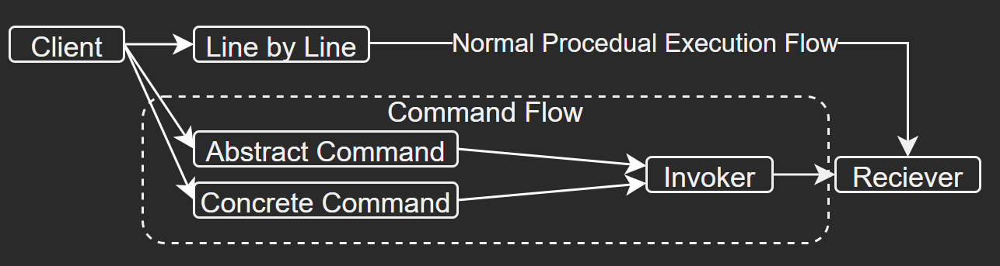

## Behavioural Patterns 
_They should all know how to talk to one another by now, right?_

## State Machine Pattern
_Essentially a fancy switch statement, right?_
\
\
Imagine an entity which can take change state such as a common locomotion. You can run, jog or walk. Each of these can be absolute states (in their finite amount) and are driven from external parameters which will select the state based on these values. As you can imagine, animation trees make extensive use of this, but I want to highlight that they also make use of blend trees. These use additive states from the base state of various amounts based on what is being input, usually creating a more dynamic looking result with infinite combinations; however, the end result doesn't have an objectively clear state.

So why would we use a finite state machine? FSMs I find to be more common, that also have a base state but are much clearer on how to inform how derivative behaviour's should be handled. This allows us to debug and segregate logic paths much easier. When architecting larger systems such as which type of UI element is currently occupying the bottom centre of the screen, a state machine can help inform external systems exactly which element is being shown. By segregating behaviours to their own classes, it naturally tidies up the codebase too and prevents monolithic classes attempting to handle all states.

Quips aside, I have seen classes littered with copy & pasted switch statements which applies all the data from one state to another. Everytime a new variation is added, a whole new switch branch for each application adding statement and makes the code very wet. It's worth highlighting the power of the active state. Upon state change, assign the new state to the active state. So if walking was now the active state, then you can always reference the ```activeState.speed``` knowing you'll get the walking speed and not the running speed, without doing a bunch of conditionals and object validation trying to get ```activeState.walkingSpeed```  beforehand.

---

# Creational Patterns
_It's just a bunch of ways to do .Instantiate() and .Destroy(), right?_

## The Factory Pattern (Object Pooling)
_If you're into recycling your rubbish, this should come naturally to you._
\
\
Factories, like in the real world produce objects, so lets take an Apple factory making iPods. They're usually all the same (instances of some static data), and lets say the shop floor is our memory. iPods populate the shop's shelves when the shop is open so the customer can browse and take whatever they choose. The iPods are allocated space on the shelves, and so the consumer removes them, then they purchase the iPod and leave the shop.

Our shop floor is now messy, and we've spent resources allocated towards originally filling and now replenishing the shelves (pending the discovery of where a shelf slot needs replenishing - an unnecessary task in itself). As you can imagine, this is expensive in terms of memory allocation, and spikes from the garbage collector will arise when too much garbage from previously allocated iPods once were.

The factory pattern solves this by permanently allocating a pool (shelf) filled with the required iPods. This is a static amount, (say 10 iPods), and is often referred to as warming the pool. This is done before the main loop of an application and contributes to processing of "the loading screen". If a customer wants to buy an iPod, the staff member will give them one from that shelf (pool). When the customer leaves the shop, we know exactly which slot to refill (in the pool). The idea is to not instantiate and destroy objects as a default behaviour, causing an unnecessarily large carbon footprint, but to reuse the same objects for a new purpose when they're returned. This greener way of thinking is a vital optimisation technique, which pays dividends in performance gains when you're making a lot of iPods globally frequently.

The data structure used to store this pool should be a [StackType](https://docs.microsoft.com/en-us/dotnet/api/system.collections.stack?view=net-6.0), as operating on a last-in-first-out basis for instances, works best.

But what people buy more than 10 iPods and they haven't all left the store yet? You get a stack overflow! Yup, that's where the website gets it's name from and no, pools shouldn't reach their "true" maximum capacity. It's good to study your application's typical usage and determine how big the statically set pool needs to be. Then, as a fallback, we can dynamically expand the pool's size with the classic create and destroy workflow which will prevent any allocation breakages, but it should be the exception to the norm. Alternatively, you could pick the oldest pooled object and recycle it, but naturally that may likely have negative connotations on the application's functionality.

## The Abstract Factory Pattern
In our Apple factory, the iPods will vary in details. Some will be black, some white. Some 128GB in storage, and some 256GB. If you start mixing these variables up, you could get a large matrix of possibilities, but ultimately they're all still iPods. How do we pool non instanced data like this?

The abstract factory pattern recognises this expontentially scaled complexity for instances with varying parameters, so we adapt the way the system works. If the iPod is of class ```iPod```, then we can override methods and properties via abstract classes for varying iPod types such as the ```Classic : iPod``` or ```Nano : iPod```.

The data will now need to be handled more elegantly rather than just adding them to a stack and popping them when one has retired. I've found that a [QueueType](https://docs.microsoft.com/en-us/dotnet/api/system.collections.queue?view=net-6.0) is an elegant way to allow on object derived from the base class type into the data structure by ensuring a first-first-out operation is applied, which means you have control over the ordering of these variations, which is usually desirable. We can mutate the pooled object in a lawfully correct way (as it's a derived abstraction) and queue it. Upon retiring the pooled object, it's efficient to initialise it back to it's base type at the back of the queue ready for reuse.

## Singleton Pattern
They're identified usually by being a static class which may be as a utility class for common functional tools for editor asset work; or perhaps they could be entitled as a manager to facilitate as a global backbone of the project.

To enforce the singleton principle you always see `if I'm (instance) != null, assign all references to me, otherwise return out as one already exists in memory` as the first thing. It can be referenced globally, and making it sealed is a sane check to ensure it never gets inherited. They usually have the name "core" or "main" and can often be one of the first classes to get initialised when running an application. Responsibility examples include being a manager for user input, for managing user all types of data, or even for managing the object pooling. 

On smaller projects they can store a lot of data, but on bigger projects this will inevitably lead to spaghetti code. Refactoring this core to manage other managers to have a tight responsibility is one way to query code concisely. On networked projects however I've discovered it's more about querying the frame data (verified rather than predicted to prevent desyncs).

# Structural Patterns

---

## Command Pattern
_It's just controlling the execution of stuff, right?_
\
\
Usually we execute code procedurally, line by line. If we run into a function in our update loop, we go into it with all parameters until we return out, then carry on. Image if we could control when that function was executed by adding a layer of abstraction to how the line of code (say a function) is executed (the command) to the next line after. We can control when it's executed too (and no, not via a coupled tricky to debug ```yield new WaitForSeconds(time)``` coroutine). Decoupling the client with the receiver requires a few extra steps, and below is what this looks like.



We begin with with choosing which way to create the command. You can either create a new abstract subclass or generate an interface for this. The abstract class (therein abstract command) will have to inherit all of it's parent's methods and properties; however, using an interface (a concrete command) allows you to apply functionality onto any object that wants it agnostic of class so you don't have to refactor a whole subset of classes.

The danger to this is that you can have classes with a lot of interfaces on which can make them messy and less dependable on class `````<Type>````` driven development. The more you can drive with polymorphism and implement the harder to pigeon hole reusable logic on top, the better.

Now that we have the command's plumbing ready, we can use a constructor to populate properties should we need to so it can be ready to be invoked. The invoker is a list like instructor who decides how and when the receiver should receive the commands. When you want to queue or stack commands, the invoker logic and associated data structure (perhaps dedicated to a manager class if it's complex) is responsible for this. Lastly, these commands are then sent to the client by the invoker's instruction. The reciever in my experience is usually the view / UI.

Although not necessary, something I've experienced in UI programming is that if you're queuing data which executes and plays a timeline such as a toast banner (with animation, audio and VFX); using a pool is a good idea to use so we can have a backlog of toasts queued to show or even overlap timelines if need be. You'd use a stack of commands for wanting to store a history. This way we can undo (and then redo) recorded "events" from the user in a deterministic fashion. Features such as a kill-cam or vehicle ghost replays make extensive use of this as they record the commands of user input, other entities and parameters, then perfectly replay the events. There is a [good write up on Ray Wenderlich](https://www.raywenderlich.com/3067863-implementing-the-command-pattern-in-unity) about how to prepare the data and then send it as a delegate to the invoker.

## Dependency Injection
_It just making sure we get all the data the same way, right?_
\
\
Less so of a pattern, but it has relevance to adhering to a "way of doing a certain thing". I've worked with netcode before which has a code generation step and bakes the data assets down for use in the client project. The client project then has to get references to those structs through the code gen. In my experienced we had a custom dependency injection system to locate the asset by passing in the netcode GUID and the type of data you want. After the code gen, you could then access the netcode properties which were initialised on the netcode project.

It did make things complicated, as a lot of APIs taken for granted on the client project (such as `Random.Range()`) cannot be done on the netcode project as it needs to be deterministic. I also noticed that there were a layer of null checks everywhere when using this.

>Finding a reference to an object is not your class/function’s problem. Finding object references is the dependency injector’s problem.

Instead of getting a reference to a static singleton which may be  a utility function to resolve an asset an you want to find, you may want to use an interface to get the reference to wherever the singleton is residing and call it from the newly injected property (which may have something like an `[Inject]` attribute on the property). It may make writing unit tests easier, but it does cause interfaces to be littered everywhere which isn't so great.